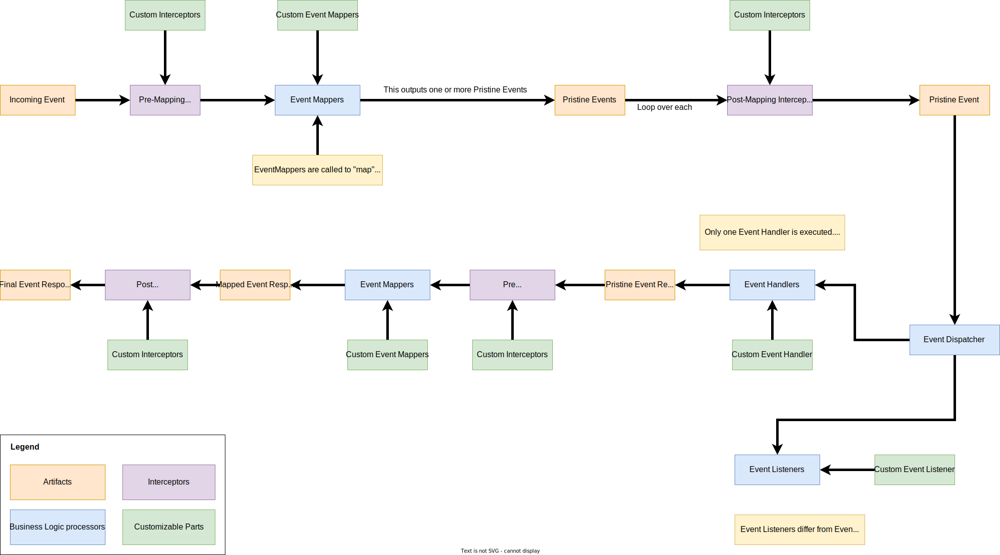

   <strong>Previous section: </strong> <a href="../01-overview/05.modules.md">Overview/Modules</a>

Events
-------

Events are at the core of Pristine. We haven't made a lot of allusion to it yet, but the only thing that Pristine 
actually does, is handle events and response to those events. That's what Pristine does.

**Really?**

Yes! If you dive into the Kernel's code, you will see that once it's instantiated, everything is treated as an Event.

Therefore, it's important to understand the lifecyle of the Events in Pristine. You can manipulate the entire flow of an
event and intervene whenever you want.

### Event Pipeline

The Event Pipeline is the main process that manages the entire flow inside Pristine. The diagram below describes the 
flow that an event takes inside Pristine.

As you can see, it's a very complex flow, but don't worry, we'll take it step by step. In this chapter, we will go
through every business logic processors (identified as blue blocks). Pristine allows you to customize the EventPipeline
to fit your specific needs. Every green block identifies a part that can be customized on your own.

### Sections
1. [Interceptor](01.interceptor.md)
2. [Event Mapper](02.event-mapper.md)
3. [Event Handler](03.event-handler.md)
4. [Event Listener](04.event-listener.md)

---

   <strong>Next section: </strong> <a href="01.interceptor.md">Interceptor</a>

